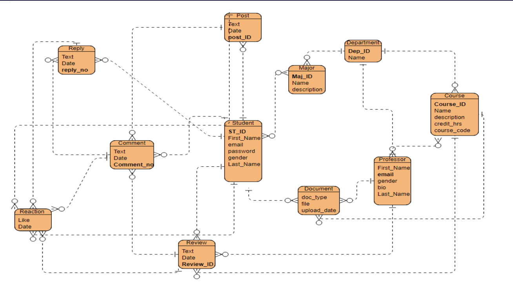

# Rate AUC Professors

Welcome to the Rate AUC Professors project repository. This project aims to provide an app-based platform specifically designed for American University in Cairo (AUC) students, enhancing their academic and social experience by offering features that address current shortcomings in existing solutions.

<!-- PROJECT SHIELDS -->
[![Contributors][contributors-shield]][contributors-url]
[![Forks][forks-shield]][forks-url]
[![Stargazers][stars-shield]][stars-url]
[![Issues][issues-shield]][issues-url]
[![License][license-shield]][license-url]


## Table of Contents

- [Introduction](#introduction)
- [Features](#features)
- [Architecture](#architecture)
- [Technologies Used](#technologies-used)
- [Installation](#installation)
- [Usage](#usage)
- [Contributing](#contributing)
- [Future Work](#future-work)
- [License](#license)

## Introduction

The primary objective of the Rate AUC Professors application is to assist students in maximizing their academic and social experiences at AUC. The application addresses various issues identified in the current Facebook-based solution, such as disorganized content, access by non-AUC students, lack of professor information, and navigation difficulties. 

## Features

- **Exclusive Access:** Only AUC students can access the platform using AUC email verification.
- **Professor Profiles:** Detailed profiles for AUC professors, including background information, teaching styles, and course organization.
- **Anonymous Feedback:** Integration of anonymous feedback and a machine-learning rating system.
- **Course Material Repository:** A repository for course-related materials.
- **Gamification System:** Points system to incentivize student engagement.
- **Structured Navigation:** Categorized and organized information for easy navigation.

## Architecture

### Front-end
- **React.js:** Utilized for building interactive user interfaces.
- **React Router:** Manages routing within the application.
- **JWT Authentication:** Enhances the security of the login process.

### Back-end
- **ASP.Net Core 7:** Framework used for server-side logic.
- **Entity Framework Core:** ORM for database interactions.
- **Repository Pattern and Unit of Work:** Design patterns used for data access and transaction management.

### Database



- **ERD Design:** Entity Relationship Diagram depicting the architecture of the database.
- **ApplicationDbContext:** Manages database context and entity relationships.

### Sentiment Analysis

- **Hugging Face API:** Integrated for sentiment analysis using pre-trained natural language processing models `roberto-base-go-emotions`.
- **Python Requests Library:** Utilized for making HTTP requests to the sentiment analysis API.
- **Sentiment-to-Emoji Mapping:** A predefined dictionary mapping sentiment labels to corresponding emojis for visual representation.
- **Predict Sentiment Function:** Responsible for sending input queries to the sentiment analysis API, retrieving the predicted sentiment labels, and mapping them to emojis based on the predefined dictionary.
- **Unit Testing:** Implemented using the `unittest` framework to ensure the accuracy and reliability of the sentiment prediction function under various scenarios.


## Technologies Used

- **Front-end:** React.js, React Router, JWT
- **Back-end:** ASP.Net Core 7, Entity Framework Core
- **Database:** SQL (via Entity Framework)
- **Testing:** Swagger for API testing

## Installation

1. **Clone the repository:**
   ```bash
   git clone https://github.com/MohamedRagabAbbas/rate-auc-professors.git
   cd rate-auc-professors
2. **Install front-end dependencies:**
   ```bash
    cd frontend
    npm install
3. **Install front-end dependencies:**
   ```bash
    cd ../backend
    dotnet restore
## Usage
1. **Run the front-end:**
   ```bash
    cd frontend
    npm start
2. **Run the back-end:**
   ```bash
    cd ../backend
    dotnet run
3. **Access the application:**
   ```bash
    Open your browser and navigate to http://localhost:3000.

## Contributing
We welcome contributions from the community. To contribute, please follow these steps:
1. Fork the repository.
2. Create a new branch (git checkout -b feature/your-feature-name).
3. Make your changes and commit them (git commit -m 'Add your feature').
4. Push to the branch (git push origin feature/your-feature-name).
5. Open a pull request.

## Future Work
We have identified several areas for future development:
* Extending the application to support other universities.
* Implementing a more sophisticated machine-learning algorithm for rating analysis.
* Enhancing the security measures for user authentication and data privacy.

## License
This project is licensed under the MIT License. See the **LICENSE** file for more details.

## Tech Stack
[](https://reactjs.org/)
[](https://dotnet.microsoft.com/apps/aspnet)
[](https://docs.microsoft.com/en-us/ef/core/)
[](https://swagger.io/)
[](https://jwt.io/)
[](https://github.com/)
[](https://www.microsoft.com/en-us/sql-server)
[](https://huggingface.co/)


<!-- MARKDOWN LINKS & IMAGES -->
[contributors-shield]: https://img.shields.io/github/contributors/MohamedRagabAbbas/Rate-AUC-Professors.svg?style=for-the-badge
[contributors-url]: https://github.com/MohamedRagabAbbas/Rate-AUC-Professors/graphs/contributors
[forks-shield]: https://img.shields.io/github/forks/MohamedRagabAbbas/Rate-AUC-Professors.svg?style=for-the-badge
[forks-url]: https://github.com/MohamedRagabAbbas/Rate-AUC-Professors/network/members
[stars-shield]: https://img.shields.io/github/stars/MohamedRagabAbbas/Rate-AUC-Professors.svg?style=for-the-badge
[stars-url]: https://github.com/MohamedRagabAbbas/Rate-AUC-Professors/stargazers
[issues-shield]: https://img.shields.io/github/issues/MohamedRagabAbbas/Rate-AUC-Professors.svg?style=for-the-badge
[issues-url]: https://github.com/MohamedRagabAbbas/Rate-AUC-Professors/issues
[license-shield]: https://img.shields.io/github/license/MohamedRagabAbbas/Rate-AUC-Professors.svg?style=for-the-badge
[license-url]: https://github.com/MohamedRagabAbbas/Rate-AUC-Professors/blob/main/LICENSE


